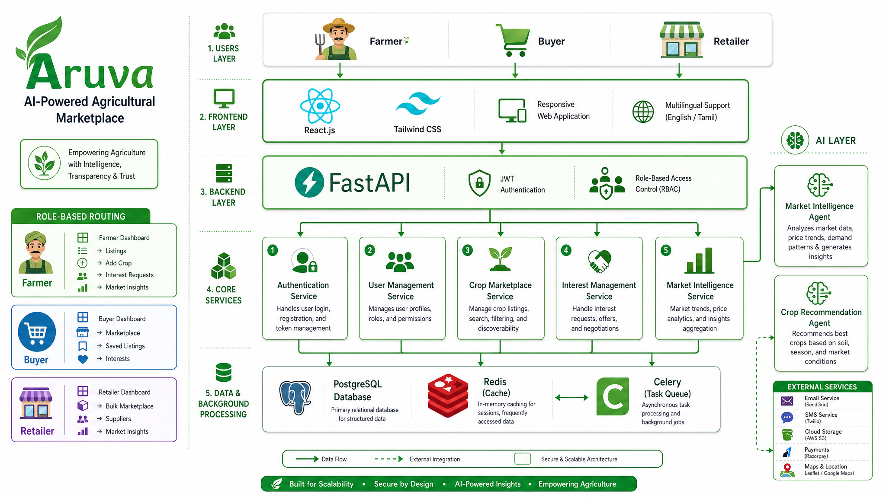

# Aruva System Architecture

## Overview

The Aruva platform follows a layered architecture consisting of:

- Frontend Layer
- Backend Layer
- Core Services Layer
- AI Layer
- Database Layer
- Background Processing Layer

The architecture supports role-based dashboards for Farmers, Buyers, and Retailers while providing AI-powered market intelligence and recommendation services.

## Architecture Diagram

## Key Components

### Frontend
- React.js
- Tailwind CSS
- Multilingual Support

### Backend
- FastAPI
- JWT Authentication
- Role-Based Access Control

### Core Services
- Authentication Service
- User Management Service
- Crop Marketplace Service
- Interest Management Service
- Market Intelligence Service

### AI Layer
- Market Intelligence Agent
- Crop Recommendation Agent

### Database & Background Processing
- PostgreSQL
- Redis
- Celery